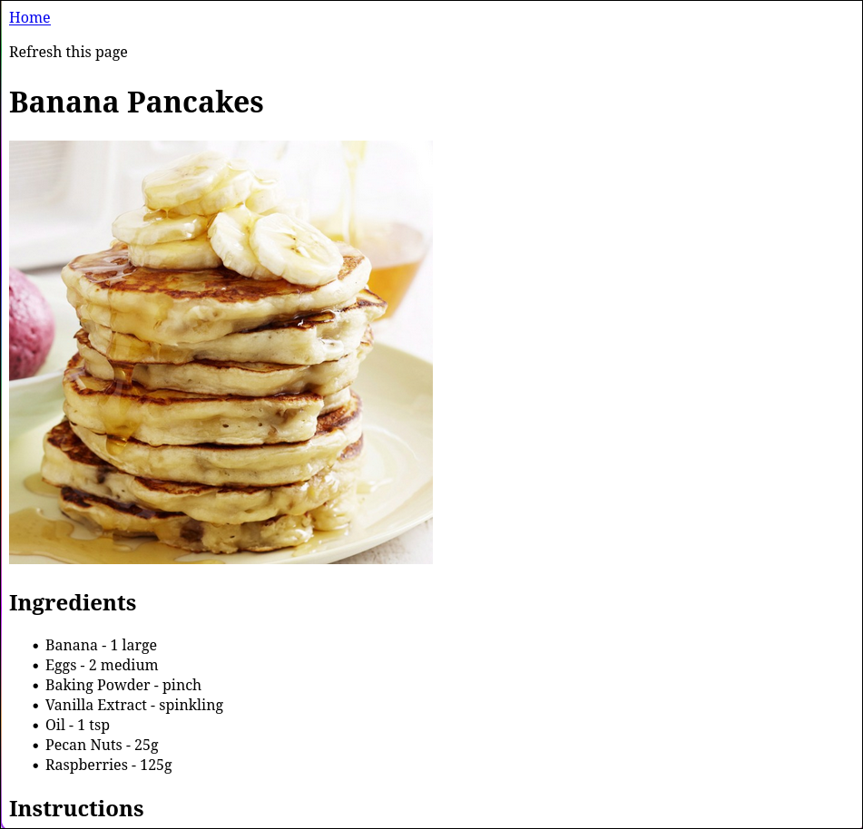

# Recipe Project

A website that stores a couple recipes and also gets a random recipe from the theMealDB API

## Possible Impovements

- A way to search for specific recipes
- A way to track your progress through a recipe
- Better styling

## Things Learned

- HTML Structure
- Good Practices
- Project Management
- Working with API's in JS